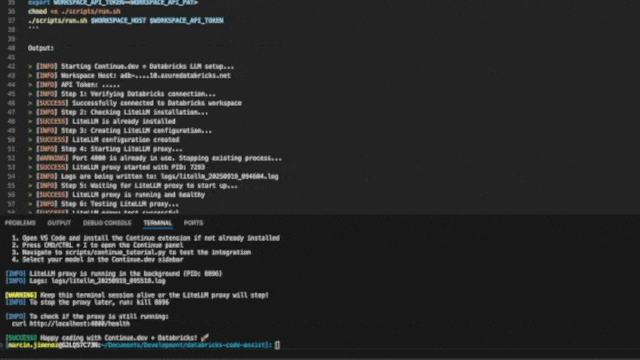

# 🚀 Continue.dev + Databricks LLM Setup Guide

This repository is a quick setup for how you can use `Continue.DEV` powered by Databricks LLMs via LiteLLM. For more info on Continue, please refer to their [page](https://github.com/continuedev/continue).

## Architectural View

```ascii
┌────────────────────────────────────────────────────────────┐
│                   Developer Workstation                    │
│                                                            │
│  ┌─────────────┐        ┌──────────────┐                   │
│  │   VS Code   │───────►│   LiteLLM    │                   │
│  │ + Continue  │◄───────│    Proxy     │                   │
│  └─────────────┘        └──────────────┘                   │
│                               │ ▲                          │
└───────────────────────────────┼─┼──────────────────────────┘
                                │ │
                                │ │ HTTPS
                                │ │ (Private & Secure)
                                │ │
                                ▼ │
                   ┌───────────────────────┐
                   │   Azure Databricks    │
                   │   ┌─────────────┐     │
                   │   │  LLM APIs   │     │
                   │   │  • Claude   │     │
                   │   │  • DBRX     │     │
                   │   │  • Llama    │     │
                   │   └─────────────┘     │
                   │  Private Workspace    │
                   └───────────────────────┘
```
         🔒 Fully Private: No data leaves your infrastructure

## Prerequisites

### System Requirements
- 💻 VS Code IDE
- 🔧 Databricks workspace with Foundation Model APIs access

## E2E In Action



## LiteLLM Installation

```bash
pip install litellm
```

## Continue.dev Installation

### Install Extension

#### GUI

1. Navigate to Extensions `(CMD/Ctrl + Shift + X)`
2. Search "Continue" 
3. Install
4. Once complete, `CMD/CTRL + I` should take you to the Continue panel

#### Mac CLI
```bash
code --install-extension Continue.continue
```

**Config Location:** `~/.continue/` (macOS/Linux) or `%USERPROFILE%\.continue\` (Windows)

## Setup TLDR; Run Script Once

Fill in the two variables. Run the script.

```bash
export WORKSPACE_HOST=adb-....10.azuredatabricks.net
export WORKSPACE_API_TOKEN=<WORKSPACE_API_PAT>
chmod +x ./scripts/run.sh
./scripts/run.sh $WORKSPACE_HOST $WORKSPACE_API_TOKEN
```

Output:

> [INFO] Starting Continue.dev + Databricks LLM setup...
> [INFO] Workspace Host: adb-....10.azuredatabricks.net
> [INFO] API Token: .....
> [INFO] Step 1: Verifying Databricks connection...
> [SUCCESS] Successfully connected to Databricks workspace
> [INFO] Step 2: Checking LiteLLM installation...
> [SUCCESS] LiteLLM is already installed
> [INFO] Step 3: Creating LiteLLM configuration...
> [SUCCESS] LiteLLM configuration created
> [INFO] Step 4: Starting LiteLLM proxy...
> [WARNING] Port 4000 is already in use. Stopping existing process...
> [SUCCESS] LiteLLM proxy started with PID: 7293
> [INFO] Logs are being written to: logs/litellm_20250919_094604.log
> [INFO] Step 5: Waiting for LiteLLM proxy to start up...
> [SUCCESS] LiteLLM proxy is running and healthy
> [INFO] Step 6: Testing LiteLLM proxy...
> [SUCCESS] LiteLLM proxy test successful
> [INFO] Step 7: Creating Continue.dev configuration...
> [SUCCESS] Continue.dev configuration created at ~/.continue/config.yaml
>
> [SUCCESS] 🎉 Setup completed successfully!
>
> [INFO] Next steps:
>   1. Open VS Code and install the Continue extension if not already installed
>   2. Press CMD/CTRL + I to open the Continue panel
>   3. Navigate to scripts/continue_tutorial.py to test the integration
>   4. Select your model in the Continue.dev sidebar
>
> [INFO] LiteLLM proxy is running in the background (PID: 7293)
> [INFO] Logs: logs/litellm_20250919_094604.log
>
> [WARNING] Keep this terminal session alive or the LiteLLM proxy will stop!
> [INFO] To stop the proxy later, run: kill 7293
>
> [INFO] To check if the proxy is still running:
>   curl http://localhost:4000/health
>
> [SUCCESS] Happy coding with Continue.dev + Databricks! 🚀

## Databricks Setup

### 🔑 Generate Access Token

```
Workspace Settings → Advanced → Personal Access Tokens → Generate New Token
```

### Store Credentials

```bash
export WORKSPACE_HOST=<your-workspace-host>
export WORKSPACE_API_TOKEN=dapi-<your-token>
```

### ✅ Verify Connection

**List endpoints:**
```bash
curl -X GET "https://$WORKSPACE_HOST/api/2.0/serving-endpoints" \
  -H "Authorization: Bearer $WORKSPACE_API_TOKEN"
```

**Test Claude:**
```bash
curl -X POST "https://$WORKSPACE_HOST/serving-endpoints/databricks-claude-sonnet-4/invocations" \
  -H "Authorization: Bearer $WORKSPACE_API_TOKEN" \
  -H "Content-Type: application/json" \
  -d '{
    "messages": [{"role": "user", "content": "Hello"}],
    "max_tokens": 10
  }'
```

## 3️⃣ LiteLLM Proxy Setup

This is needed to support the OpenAI compliant nature of Continue.DEV code assistant. This utility will need to run while VSCode is open.

### 🔧 Install & Configure
```bash
# Install LiteLLM
pip install 'litellm[proxy]' --upgrade

# Create config from template
sed -e "s/\${WORKSPACE_HOST}/$WORKSPACE_HOST/g" \
    -e "s/\${WORKSPACE_API_TOKEN}/$WORKSPACE_API_TOKEN/g" \
    config/litellm_config.template.yaml > litellm_config.yaml

# Start proxy, should notice logs appearing
DATETIME=$(date '+%Y%m%d_%H%M%S') && nohup litellm --config litellm_config.yaml --port 4000 > logs/litellm_${DATETIME}.log 2>&1 &
```

### 🧪 Test LiteLLM
Open new terminal:
```bash
curl -X POST "http://localhost:4000/v1/chat/completions" \
   -H "Content-Type: application/json" \
   -d '{
     "model": "claude-sonnet-4",
     "messages": [
       {"role": "user", "content": "Hello, can you hear me?"}
     ],
     "max_tokens": 100
   }'
```

## 4️⃣ Continue.dev Configuration

### 📝 Create Config
```bash
# Generate from template (make sure ENV vars are loaded)
sed -e "s/\${WORKSPACE_HOST}/$WORKSPACE_HOST/g" \
    -e "s/\${WORKSPACE_API_TOKEN}/$WORKSPACE_API_TOKEN/g" \
    config/continue-config.template.yaml > ~/.continue/config.yaml
```

## 5️⃣ Final Testing

### 🎯 Test Your Setup
1. 📂 Navigate to `scripts/continue_tutorial.py`
2. 💬 Follow the comments to test Continue.dev + Databricks integration
3. 🎉 Select your model in Continue.dev sidebar

## ⚡ Quick Reference

### Required Config Parameters
```yaml
provider: openai              # Always "openai" for Databricks
model: claude-sonnet-4        # Exact model name
apiBase: http://localhost:4000/v1  # LiteLLM proxy URL
apiKey: dummy                 # Or your master key if configured
```

### Model Roles
```yaml
roles:
  - chat         # 💬 Conversations
  - edit         # ✏️ Code editing
  - apply        # ✔️ Apply changes
  - autocomplete # 🔮 Tab completion
```

💡 **Pro Tip:** Keep LiteLLM running in a separate terminal or use `nohup` for background operation!

🎉 **Happy Coding with Continue.dev + Databricks!**
