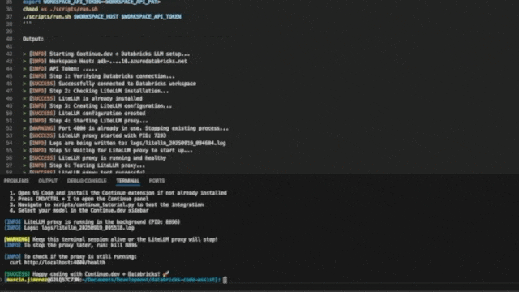

# Databricks Code Assist

A CLI tool for setting up AI coding assistants (Aider, Continue.dev) with Databricks LLMs.



## Installation

```bash
pip install -e .
```

## Quick Start

### 1. Setup

```bash
databricks-code-assist setup
```

This will prompt for your Databricks workspace host and API token, then configure everything automatically.

### 2. Validate

```bash
databricks-code-assist validate
```

Tests the connection to Databricks and the LiteLLM proxy.

### 3. Run

**Start Aider (terminal-based coding assistant):**

```bash
databricks-code-assist run aider
```

**Start Continue.dev (VS Code extension):**

```bash
databricks-code-assist run continue
```

Then open VS Code and press `Cmd/Ctrl+I` to use Continue.

## Commands

| Command | Description |
|---------|-------------|
| `databricks-code-assist setup` | Configure Databricks credentials |
| `databricks-code-assist validate` | Test the connection |
| `databricks-code-assist run aider` | Start Aider with Databricks LLM |
| `databricks-code-assist run continue` | Start Continue.dev with Databricks LLM |
| `databricks-code-assist status` | Show current configuration |
| `databricks-code-assist stop` | Stop the LiteLLM proxy |

## Options

All commands support these options:

```bash
--port PORT    # LiteLLM proxy port (default: 4000)
--help         # Show help
```

Setup command options:

```bash
--host HOST        # Databricks workspace URL
--api-key KEY      # Databricks API token
--model MODEL      # Model name (default: claude-sonnet-4)
```

## Examples

### Using Aider with specific files

```bash
databricks-code-assist run aider -- file1.py file2.py
```

### Using Aider in read-only mode

```bash
databricks-code-assist run aider -- --read myfile.py
```

### Custom port

```bash
databricks-code-assist setup --port 5000
databricks-code-assist run aider --port 5000
```

## Configuration

Configuration is stored in `~/.databricks-code-assist/`:

- `config.yaml` - Databricks credentials and settings
- `litellm_config.yaml` - LiteLLM proxy configuration
- `logs/` - LiteLLM proxy logs

## Environment Variables

You can also set credentials via environment variables:

```bash
export DATABRICKS_HOST=your-workspace.cloud.databricks.com
export DATABRICKS_TOKEN=dapi-your-token
```

## Building a ReAct Agent

See [examples/react_agent.py](examples/react_agent.py) for a complete example of building a ReAct (Reasoning + Acting) agent using Databricks LLMs.

```python
from databricks_code_assist.react import ReActAgent

agent = ReActAgent(tools=[search, calculator])
result = agent.run("What is the population of France divided by 1000?")
```

## Requirements

- Python 3.9+
- Databricks workspace with Foundation Model APIs access
- VS Code (for Continue.dev)
